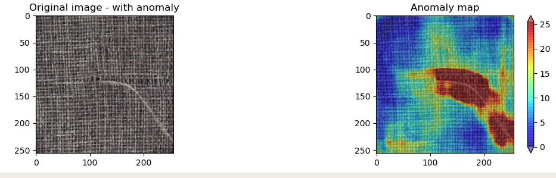
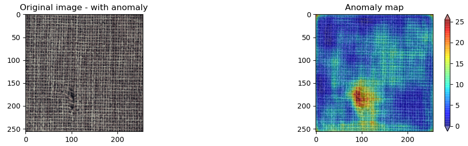
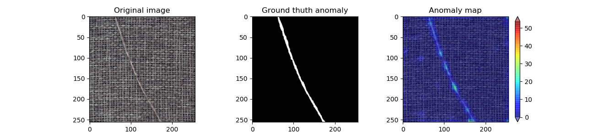
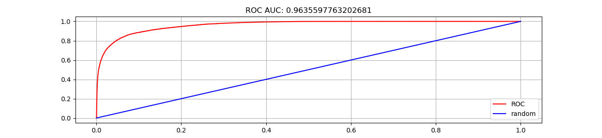

# Student-Teacher anomaly detection
This is an implementation of the paper [Uninformed Students: Student–Teacher Anomaly Detection
with Discriminative Latent Embeddings](https://arxiv.org/pdf/1911.02357v2.pdf). 

## How to use

* Run the mvtec_dataset.sh script to download and prepare the [MVTec dataset](https://www.mvtec.com/company/research/datasets/mvtec-ad/) in the correct format. This requires about 5GB of disk space.
```
./mvtec_dataset.sh
```

* The __data__ folder should be available now. Each subfolder in __data__ has the name of a category. Let us build a model for the category __carpet__ as an example.

* (Optional) Run resnet18_training.py script to train resnet18 further on your dataset
```
cd src
python3 resnet18_training.py --dataset carpet
```

* Run teacher_training.py to distil the knowledge of resnet18 on a smaller neural network. This will speed up the processing of images. This neural network, called the Teacher, outputs a 512-dimensional description vector for each patch of size <patch_size> of the image.
The supported patch_size values are:
    * size = 17, effective if we are looking for small size anomalies
    * size = 33, effective if we are looking for medium size anomalies
    * size = 65, effective if we are looking for big size anomalies
```
cd src
python3 teacher_training.py --dataset carpet --patch_size 33 
```

* Run students_training.py to train a set of M=3 students against the teacher network. The training of the students is done on an anomaly-free dataset. We expect them to generalize poorly in images containing anomalies
```
cd src
python students_training.py --dataset carpet --patch_size 33 --n_students 3
```

* Run anomaly_detection.py to obtain an anomaly map for each image of the test set. An anomaly map is computed using the variance of Students predictions and the error between Students predictions and Teacher.
```
cd src
python anomaly_detection.py --dataset carpet --patch_size 33 --n_students 3
```

## Results




And more results are available under **/result** folder

## Performance


## References

### Original paper
* [https://arxiv.org/pdf/1911.02357v2.pdf](https://arxiv.org/pdf/1911.02357v2.pdf)

### MVTec dataset paper
* [https://openaccess.thecvf.com/content_CVPR_2019/papers/Bergmann_MVTec_AD_--_A_Comprehensive_Real-World_Dataset_for_Unsupervised_Anomaly_CVPR_2019_paper.pdf](https://openaccess.thecvf.com/content_CVPR_2019/papers/Bergmann_MVTec_AD_--_A_Comprehensive_Real-World_Dataset_for_Unsupervised_Anomaly_CVPR_2019_paper.pdf)

### Fast Dense Feature Extraction
* [https://www.dfki.de/fileadmin/user_upload/import/9245_FastCNNFeature_BMVC.pdf](https://www.dfki.de/fileadmin/user_upload/import/9245_FastCNNFeature_BMVC.pdf)
* [https://github.com/erezposner/Fast_Dense_Feature_Extraction](https://github.com/erezposner/Fast_Dense_Feature_Extraction)
